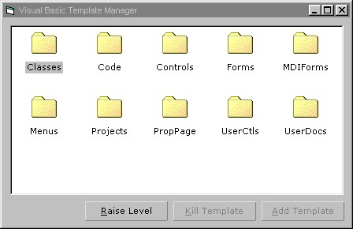



## Visual Basic Template Manager Version 2

### Description

*Version 2: Added Delete Template Function

Visual Basic Template Manager 2.0 can be used to help make those forms that you use all the time easier to access. All you have to do is select the area to go into and select the file. This will then permently be shown when you add an object in VB 6. PLEASE VOTE FOR MY WORK. Comments and bugs are also appreciated.
 
### More Info
 

             |
---                |---
**Submitted On**   |2001-04-02 16:09:52
**By**             |[MidWestEspresso](https://github.com/Planet-Source-Code/PSCIndex/blob/master/ByAuthor/midwestespresso.md)
**Level**          |Advanced
**User Rating**    |4.4 (31 globes from 7 users)
**Compatibility**  |VB 6\.0
**Category**       |[VB function enhancement](https://github.com/Planet-Source-Code/PSCIndex/blob/master/ByCategory/vb-function-enhancement__1-25.md)
**World**          |[Visual Basic](https://github.com/Planet-Source-Code/PSCIndex/blob/master/ByWorld/visual-basic.md)
**Archive File**   |[Visual Bas17838422001\.zip](https://github.com/Planet-Source-Code/midwestespresso-visual-basic-template-manager-version-2__1-22093/archive/master.zip)

